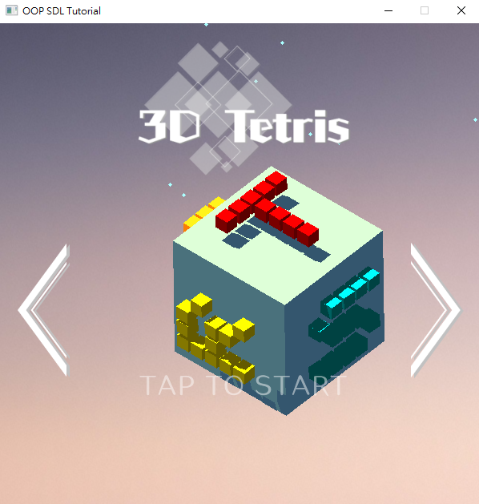
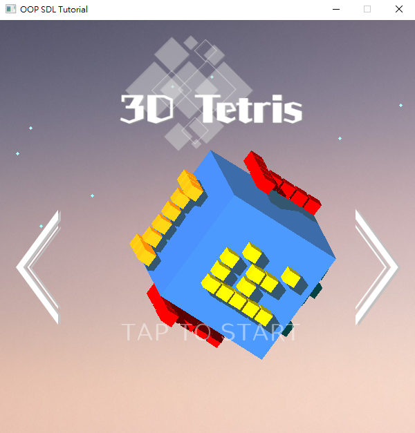
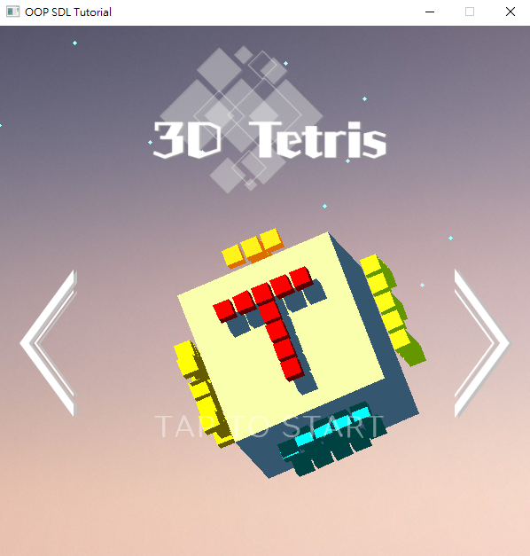
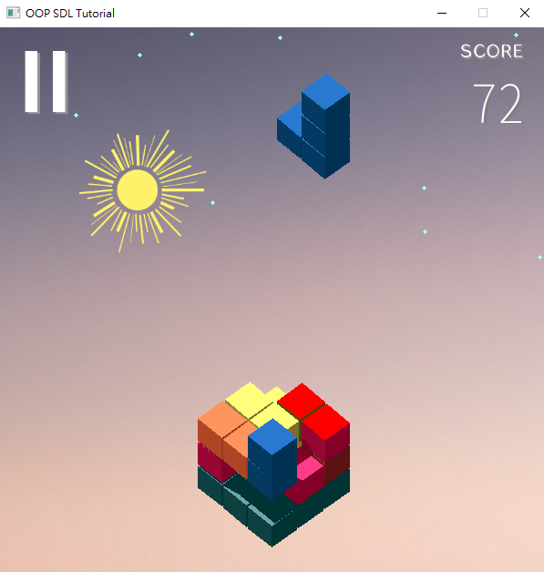
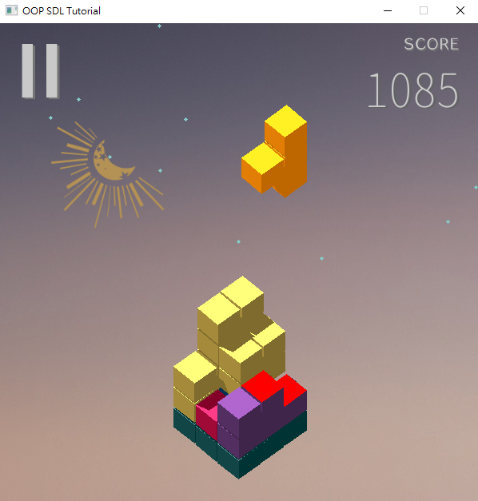
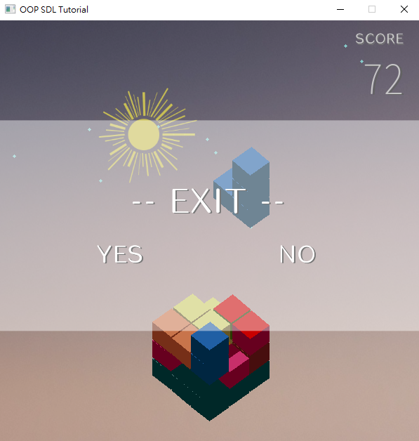
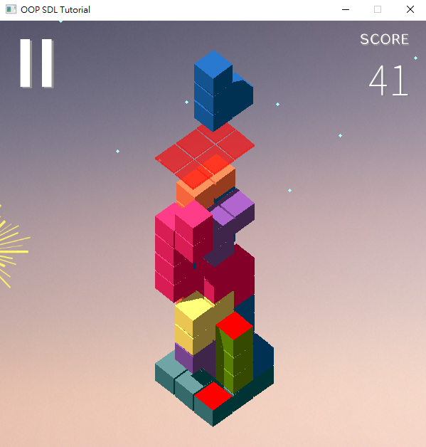

# Welcome to Our 3D Tetris Game !
#### This is a 3D Tetris Game with elaborate figures: <br>


## Getting Started
1. Download the repo
2. Click **```3D_Tetris_exe\Example.exe```**
## How to play?

### Mouse:
1. Click left and right hands side icon can change background and music. <br>
2. Click "Tap to start" to start the game. <br>

### Keyboard:
  **```C / V```** : Rotate the base **clockwise** / **counterclockwise** <br>
  **```H / B / N / M```** : Move falling tetris **front / back / left / right** <br>
  **```← / →```** : Rotate falling tetris **clockwise** / **counterclockwise** <br>
  [All actions are limited in the base area, if out of area, print "Cannot" and can not shift or rotate] <br>
  **```↓```** : **Speed up** falling tetris <br>

Click icon on the upper left side can **```pause```** the game.

## Here are some demo samples:
#### This is our teaser figures:

<p float="left">
  
  
</p>

#### We have daylight and night backgound with sun and moon moving across our background:

<p float="left">
  
  
</p>

#### Click icon on the upper left can pause the game. 
<p float="left">
  
  
</p>

#### We set a deadline hint, if tetris blocks are higher than the deadline, **```Game Over```** !

## Reference
Kubik: https://apps.apple.com/gb/app/kubik/id1187617475
